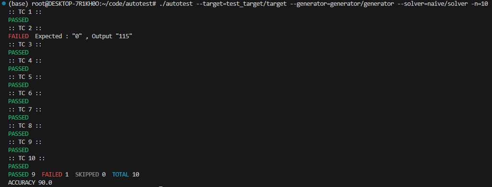

# (CLI) Auto Testing for Competition Programming Problems In Linux

A CLI auto tester, allows input text generator program and output generator which use stdin/stdout written by C++.



<br/>
<br/>

## How to use
First, build this project.   
You can use Makefile like below. (`g++[gcc]` and `make` are required)
```bash
$ make
```

Then `aututest` is built at root directory of project.   
You can run this like.
```bash
$ ./autotest --target=test_target/target --generator=generator/generator --solver=naive/solver -n=10
```

You can see *help* document with `--help` option.
